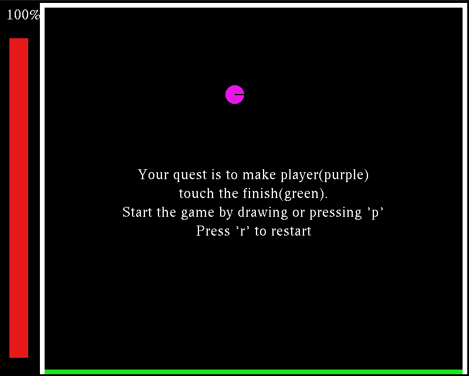
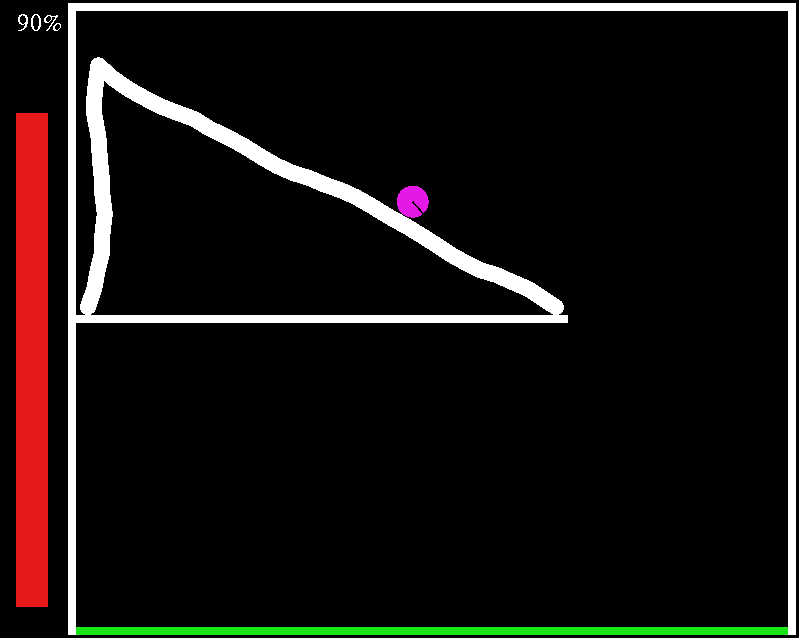
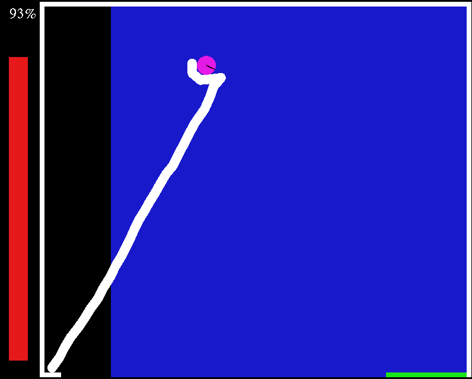

# Remake of mobile game Brain It On!
 This game is semester work for class Programing and Algorithmization II. Assignment allowed only limited set of libraries which we could use, that's why graphics uses deprecated OpenGL v.2 with glut.

### Usage
compile with `make compile`,
run with `make run`

create documentation with `make doc`

### Rules
- Your task in all levels is to get **player**
( purple object ) to **finish**( green object )
- You can achieve this by drawing with mouse
- Player health is shown on left of the screen
- Player looses health by **colliding** with objects
- You also get **penalized** for drawing to much
- You **can't** draw over **blue** areas.

### Controls
- draw simply by dragging mouse
- pause/play at any time using `P`
- restart at any time using `R`
- quit at any time using `Q`

### Level creation
- All levels are stored as JSON documents inside assets. Game starts with tutorial_1.
- You can explore assets/level_template.json to see capabilities.
- Entire level loading is contained in src/levelLoader.cpp, feel free to merge in new features.

